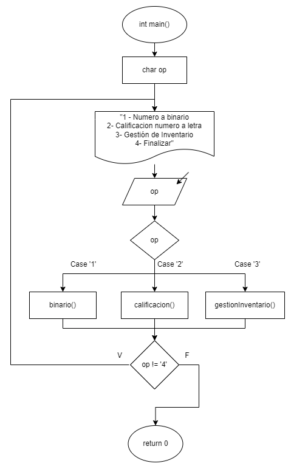
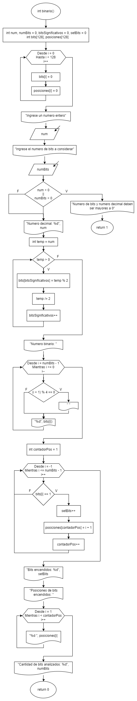
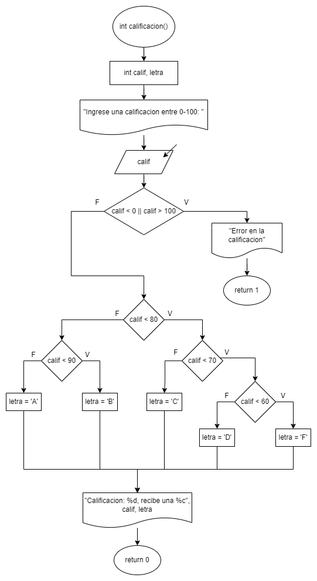
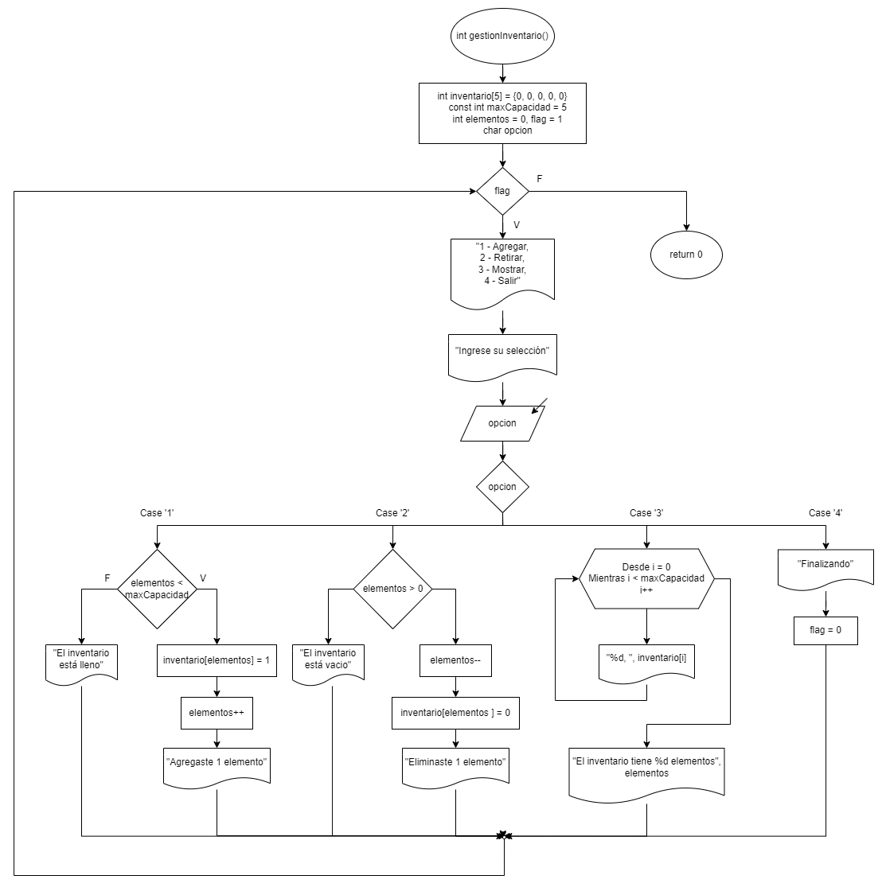

# Práctica 2. Tipos, operadores y expresiones

Clase: Lenguaje C

### Instrucciones

---

Desarrollen el código en lenguaje C y elaboren el diagrama de flujo
correspondiente para los ejercicios. Será suficiente con un archivo .cpp que contenga todos los ejercicios organizados en un menú implementado mediante una estructura switch.

### Repositorio

---

[https://github.com/Scalaptia/Practica2_TiposOperadoresYExpresiones](https://github.com/Scalaptia/Practica2_TiposOperadoresYExpresiones)

### Inicio

---

**Diagrama de flujo:**



**Código:**

Definimos la variable “op” que utilizaremos para decidir a que función queremos entrar.

```c
char op;
```

Mostramos el menú al usuario y limpiamos la pantalla cuando se lee su selección.

```c
printf("------------- Menu -------------\n");
printf("1 - Numero a binario\n");
printf("2 - Calificacion numero a letra\n");
printf("3 - Gestion de inventario\n\n");
printf("Ingrese su seleccion: ");
scanf(" %c", &opcion);
system("cls");
```

Creamos un switch dentro de un ciclo donde dependiendo de la opción ingresada se ejecuta su respectiva función.

```c
do
{
		switch (opcion)
		{
		case '1':
				binario();
				break;

		case '2':
				calificacion();
				break;

		case '3':
				gestionInventario();
				break;
		}
} while (op != 0);
```

### Problemas

---

**1- Crear un programa que permita a los usuarios ingresar un número entero, especificar el número de bits que se deben considerar y luego analizar el número en términos de bits encendidos, posiciones y representación binaria.**

**Diagrama de flujo:**



**Código:**

Definimos todas las variables que necesitaremos para cada una de las

```c
int num, numBits = 0, bitsSignificativos = 0, setBits = 0;
int bits[128], posiciones[128];
```

Inicializamos los arreglos de bits y de posiciones con ceros en todas las posiciones para no tener basura almacenada.

```c
for (int i = 0; i < 128; i++)
{
		bits[i] = 0;
		posiciones[i] = 0;
}
```

Leemos el número que desea convertir a binario y los bits que el programa debe considerar

```c
printf("Ingrese un numero entero: ");
scanf("%d", &num);
printf("Ingrese el numero de bits a considerar: ");
scanf("%d", &numBits);
system("cls");
```

Verificamos que los números sean mayores a cero, en el caso de que no lo sean retornamos un código de error (1).

```c
if (num < 0 || numBits < 0)
{
		printf("Numero de bits y numero decimal deben ser mayores a 0");
		return 1;
}
```

Imprimimos el número ingresado, luego declaramos una variable temporal con el valor de este numero para no modificar el original.

Iniciamos un ciclo while donde se divide entre dos y se guarda el residuo en el arreglo de bits, y en cada ciclo hacemos lo mismo con el valor ya dividido para tener el número en binario almacenado en el arreglo de bits.

```c
printf("Numero decimal: %d\n", num);

// Convertir a binario
int temp = num;
while (temp > 0)
{
    bits[bitsSignificativos] = temp % 2;
    temp /= 2;
    bitsSignificativos++; // Longitud del arreglo
}
```

Recorremos en reversa el arreglo de bits que acabamos de definir, para así imprimir el número binario en orden, agregando un espacio entre cada 4 bits para que sea más legible.

```c
// Imprimir numero binario
printf("Numero binario: ");
for (int i = numBits - 1; i >= 0; i--)
{
    if ((i + 1) % 4 == 0)
        printf(" "); // Imprime un espacio entre cada 4 bits
    printf("%d", bits[i]);
}
```

Recorremos el arreglo de bits en orden para contar la cantidad de bits encendidos y almacenar las posiciones de estos en su respectivo arreglo. En seguida imprimimos esa cantidad de bits encendidos y el arreglo de posiciones de manera regresiva para tenerlos en orden ascendente.

```c
int contadorPos = 1;
for (int i = -1; i <= numBits - 1; i++)
{
    if (bits[i] == 1)
    {
        setBits++
        posiciones[contadorPos] = i + 1;
        contadorPos++;
    }
}

printf("\nBits encendidos: %d", setBits);

printf("\nPosiciones de bits encendidos: ");
for (int i = 1; i < contadorPos; i++)
{
    printf("%d ", posiciones[i]);
}
```

Imprimimos la cantidad de bits analizados y retornamos un código de exito (0).

```c
printf("\nCantidad de bits analizados: %d", numBits);

printf("\n");
system("PAUSE");
return 0;
```

---

**2- Crear un programa que tome una calificación numérica y la convierta en una calificación en letra utilizando operadores ternarios.**

**Diagrama de flujo:**



**Código:**

Declaramos las variables que utilizaremos durante la ejecución del programa.

```c
int calif, letra;
```

Leemos la calificación que se desea analizar.

```c
printf("Ingrese una calificacion entre 0-100: ");
scanf("%d", &calif);
```

Si la calificación no esta en el rango de 0-100, enviamos un error y retornamos un código de error.

```c
if (calif < 0 || calif > 100)
{
    printf("Error en la calificacion\n");
    system("PAUSE");
    return 1;
}
```

Utilizando operadores ternarios, verificamos cada situación en la que la calificación.

```c
(calif < 80)
    ? (calif < 70)
          ? (calif < 60)
                ? (letra = 'F')
                : (letra = 'D')
          : (letra = 'C')
: (calif < 90)
    ? (letra = 'B')
    : (letra = 'A');
```

Imprimimos la calificación y su letra que recibió. Retornamos un código de éxito (0).

```c
printf("Calificacion: %d, recibe una %c\n", calif, letra);
system("PAUSE");
return 0;
```

---

**3- El objetivo de este ejercicio es simular un sistema básico de gestión de inventario en C, donde los usuarios pueden agregar y retirar elementos del inventario.**

**Diagrama de flujo:**



**Código:**

Declaramos nuestro arreglo de inventario con ceros en todas las posiciones, la capacidad máxima como una constante, y las variables que necesitaremos durante la ejecución del programa.

```c
int inventario[5] = {0, 0, 0, 0, 0};
const int maxCapacidad = 5;
int elementos = 0, flag = 1;
char opcion;
```

Inicializamos un bucle _while_ en el cual estará contenido el resto de nuestro programa, y solo terminará cuando el usuario ingrese 0 en el menú, así activando la bandera.

```c
while (flag)
{
		...
}
```

Mostramos todas las opciones disponibles para el usuario y leemos su selección en la variable opción.

```c
printf("------------- Inventario -------------\n");
printf("1 - Agregar\n");
printf("2 - Retirar\n");
printf("3 - Mostrar\n");
printf("4 - Salir\n\n");
printf("Ingrese su seleccion: ");
scanf(" %c", &opcion);
system("cls");
```

Inicializamos un switch donde se ejecutará la acción ingresada por el usuario.

```c
switch (opcion)
{
		...
}
```

En el caso 1 (Agregar al inventario), verificamos si la cantidad de elementos es menor a la capacidad máxima del inventario, en caso de que si sea menor agregamos un 1 en la ultima posición vacía del arreglo y sumamos 1 a la cantidad de elementos. En el caso de que el inventario esté lleno, le notificamos al usuario y no agregamos nada.

```c
case '1':
    if (elementos < maxCapacidad)
    {
        inventario[elementos] = 1;
        elementos++;
		    printf("Agregaste 1 elemento\n");
    }
    else
    {
        printf("El inventario está lleno\n");
    }
    break;
```

En el caso 2 (Retirar del inventario), verificamos si la cantidad de elementos es mayor a 0, en caso de que si lo sea eliminamos el ultimo elemento de la lista y restamos uno al total de elementos almacenados. En caso de que el inventario ya esté vacío se notifica al usuario y no retiramos nada.

```c
case '2':
		if (elementos > 0)
		{
				elementos--;
		    inventario[elementos] = 0;
		    printf("Eliminaste 1 elemento\n");
		}
		else
		{
		    printf("El inventario está vacio\n");
		}
		break;
```

En el caso 3 (Mostrar), imprimimos todo el arreglo y mostramos la cantidad de elementos.

```c
case '3':
		for (int i = 0; i < maxCapacidad; i++)
		{
		    printf("%d, ", inventario[i]);
		}
		printf("El inventario tiene %d elementos\n", elementos);
		break;
```

En el caso 4 (Finalizar), cambiamos la bandera a 0, efectivamente terminando el ciclo y retornamos la función para terminar el programa.

```c
case '4':
    printf("Finalizando...");
    flag = 0;
    break;
}
```
