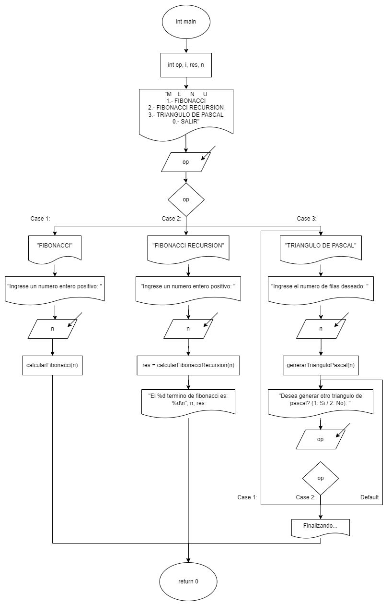
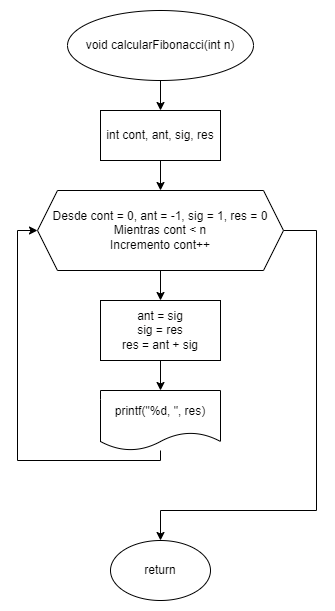
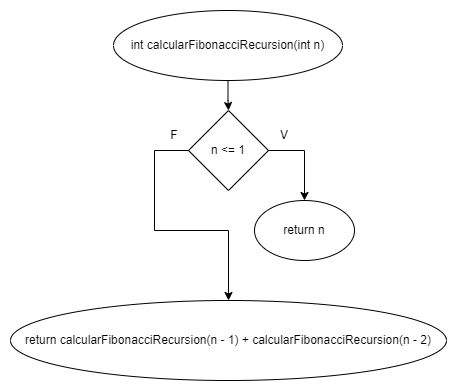
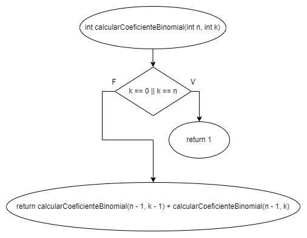
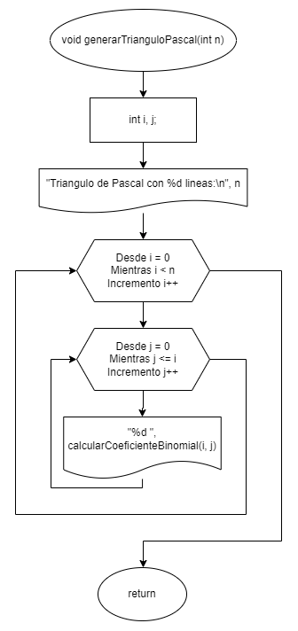

# Práctica 4. Funciones con retorno y sin retorno

Clase: Lenguaje C

### Instrucciones

---

Desarrollen el código en lenguaje C y elaboren el diagrama de flujo correspondiente para los ejercicios. Será suficiente con un archivo .cpp que contenga todos los ejercicios organizados en un menú implementado mediante una estructura switch.

### Inicio

---

**Diagrama de flujo:**



**Código:**

Definimos la variable `op` que utilizaremos para decidir a que función queremos entrar. También declaramos la variable `res` para asignar el resultado en la función recursiva y la función `n` que servirá como argumento en cada función.

```c
int op, res, n;
```

Creamos un ciclo do while, dentro del ciclo mostramos el menú al usuario y limpiamos la pantalla cuando se lee su selección.

```c
do
{
    system("CLS");
    printf("   M  E   N   U \n");
    printf("1.- FIBONACCI \n");
    printf("2.- FIBONACCI RECURSION \n");
    printf("3.- TRIANGULO DE PASCAL \n");
    printf("0.- SALIR  \n");
    printf("ESCOGE UNA OPCION: ");
    scanf("%d", &op);
    system("CLS");

		...

} while (op != 0);
```

Creamos un switch dentro del ciclo donde dependiendo de la opción ingresada se ejecuta su respectiva función.

```c
switch (op)
{
case 1:
    // TITULO
    printf("   FIBONACCI \n");
    printf("Ingrese un numero entero positivo: ");
    scanf("%d", &n);

    calcularFibonacci(n);
    system("PAUSE");
    break;

case 2:
    // TITULO
    printf("   FIBONACCI RECURSION \n");
    printf("Ingrese un numero entero positivo: ");
    scanf("%d", &n);

    res = calcularFibonacciRecursion(n);
    printf("\nEl %d termino de fibonacci es: %d\n", n, res);
    system("PAUSE");
    break;

case 3:
pascal:
    // TITULO
    printf("   TRIANGULO DE PASCAL \n");
    printf("Ingrese el numero de filas deseado: ");
    scanf("%d", &n);

    generarTrianguloPascal(n);
    printf("\n");
    system("PAUSE");

reinicio:
    system("CLS");
    printf("\nDesea generar otro triangulo de pascal? (1: Si / 2: No): ");
    scanf("%d", &op);

    switch (op)
    {
    case 1:
        system("CLS");
        goto pascal;
        break;

    case 2:
        system("CLS");
        printf("Finalizando...\n");
        system("PAUSE");
        break;

    default:
        goto reinicio;
        break;
    }
}
```

### Problemas

---

**1- Fibonacci sin Recursión:** Crea un programa que calcule y muestre los primeros n términos de la serie de Fibonacci sin utilizar recursión.

**Diagrama de flujo:**



**Código:**

Inicializamos las variables necesarias para el calculo de Fibonacci.

```c
int cont, ant, sig, res;
```

Creamos un ciclo for donde inician las variables contador en 0, anterior en -1, siguiente en 1, y resultado en 0. El ciclo se detendrá cuando se calcule el n termino de Fibonacci (que fue pasado como argumento a la función).

En cada ciclo pasamos el siguiente a ser el anterior, el resultado a ser el siguiente, y calculamos el resultado del n termino de Fibonacci como el anterior + el siguiente.

En cada repetición imprimimos el n termino de Fibonacci, creando así la cadena completa.

```c
for (cont = 0, ant = -1, sig = 1, res = 0; cont < n; cont++)
{
    ant = sig;
    sig = res;
    res = ant + sig;
    printf("%d, ", res);
}
printf("\n");
```

---

**2- Fibonacci con Recursión:** Crea un programa en C que calcule y muestre el término n de la serie de Fibonacci utilizando una función recursiva.

**Diagrama de flujo:**



**Código:**

En el caso base, checamos si `n` es menor o igual a 1 (puede ser 1 o 0), y retornamos `n`.

```c
if (n <= 1)
{
    return n;
}
```

En el caso recursivo, la función se llama a sí misma dos veces: una vez con **`n - 1`,** y otra vez con **`n - 2`**. Luego, suma los resultados de estas dos llamadas recursivas para obtener el resultado final.

```c
return calcularFibonacciRecursion(n - 1) + calcularFibonacciRecursion(n - 2);
```

---

**3- Triángulo de Pascal:** Crea un programa en C que genere y muestre las primeras n filas del Triángulo de Pascal.

**Diagrama de flujo:**





**Código:**

Primero, definimos una función para calcular el coeficiente binomial que calculará el coeficiente binomial C(n, k) utilizando una función recursiva. Se utiliza para calcular los valores en el Triángulo de Pascal.

La función toma dos parámetros: `n` y **`k`**, que representan el número total de elementos y el número de elementos a elegir, respectivamente.

En el caso base, checamos si **`k`** es igual a 0 o si **`k`** es igual a **`n`**, entonces el resultado es 1, ya que hay solo una forma de elegir 0 elementos de un conjunto o elegir todos los elementos de un conjunto.

En el caso recursivo la función se llama a sí misma dos veces: una vez con **`n - 1`** y **`k - 1`**, y otra vez con **`n - 1`** y **`k`**. Luego, suma los resultados de estas dos llamadas recursivas para obtener el resultado final.

```c
int calcularCoeficienteBinomial(int n, int k)
{
    // Caso Base
    if (k == 0 || k == n)
    {
        return 1;
    }

    // Caso Recursivo
    return calcularCoeficienteBinomial(n - 1, k - 1) + calcularCoeficienteBinomial(n - 1, k);
}
```

La función de triangulo de pascal, toma un parámetro **`n`**, que indica cuántas filas del Triángulo de Pascal se deben generar.

Utiliza dos bucles for anidados para recorrer cada fila y cada elemento de esa fila, dentro del bucle anidado, llama a **`calcularCoeficienteBinomial(i, j)`** para obtener el coeficiente binomial correspondiente y lo imprime en la pantalla.

```c
void generarTrianguloPascal(int n)
{
    int i, j;

    printf("\nTriangulo de Pascal con %d lineas:\n", n);

    for (i = 0; i < n; i++)
    {
        for (j = 0; j <= i; j++)
        {
            printf("%d ", calcularCoeficienteBinomial(i, j));
        }
        printf("\n");
    }
}
```
