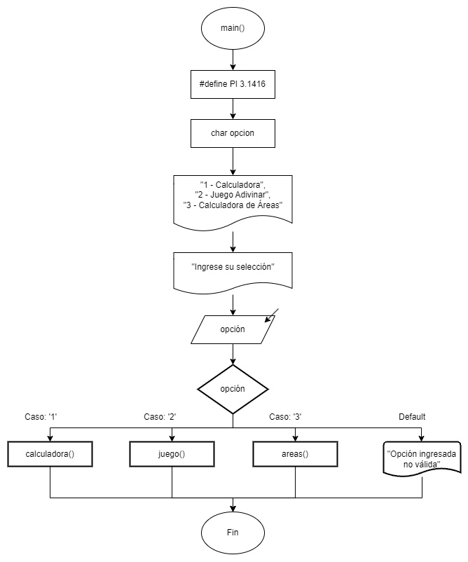
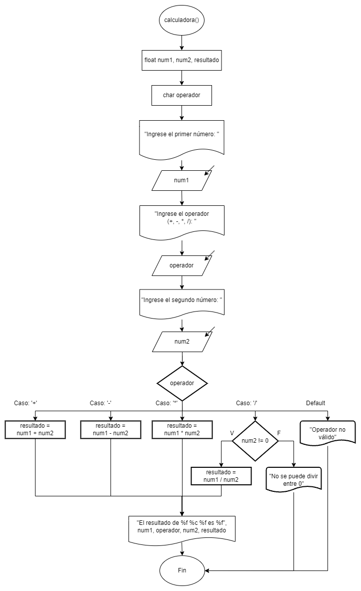
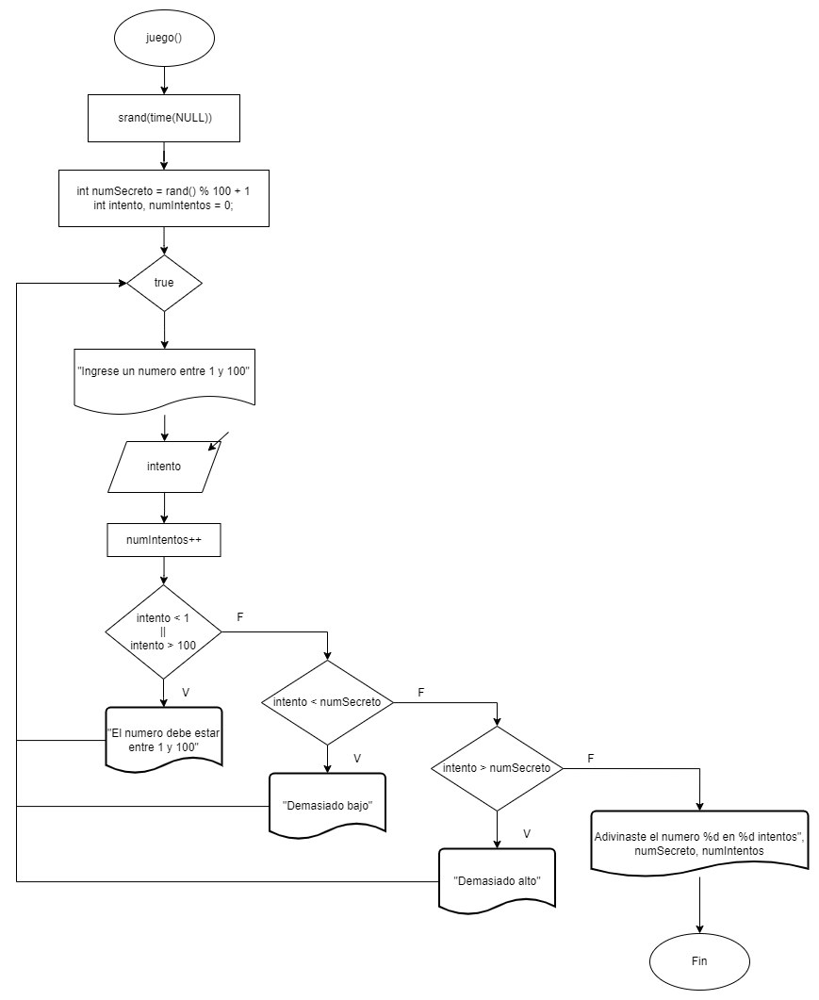
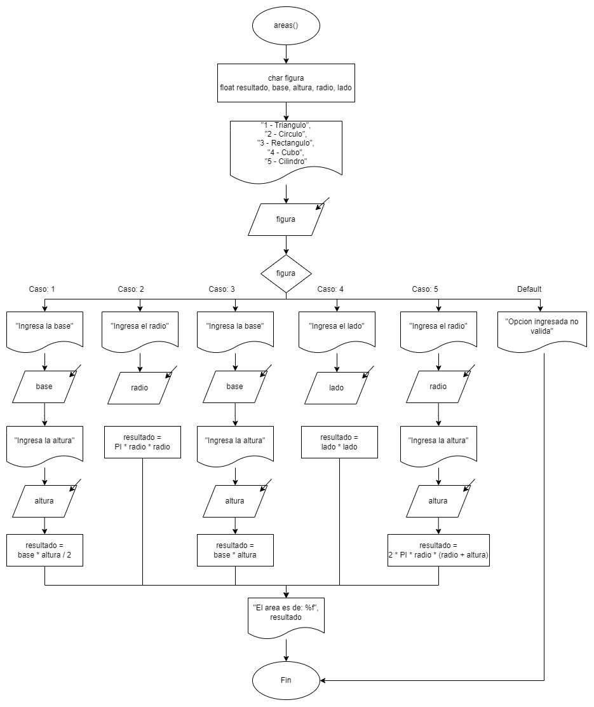

# Práctica 1. Conceptos Generales

### Instrucciones

---

Desarrollen el código en lenguaje C y elaboren el diagrama de flujo
correspondiente para los ejercicios. Será suficiente con un archivo .cpp que contenga todos los ejercicios organizados en un menú implementado mediante una estructura switch.

### Repositorio

---

[https://github.com/Scalaptia/Practica1_ConceptosGenerales](https://github.com/Scalaptia/Practica1_ConceptosGenerales)

### Inicio

---

**Diagrama de flujo:**



**Código:**

Definimos la constante simbólica _PI_ que se utilizará para el código de áreas, y la variable opción que utilizaremos para decidir a que función queremos entrar.

```c
#define PI 3.1416
char opcion;
```

Mostramos el menú al usuario y limpiamos la pantalla cuando se lee su selección.

```c
printf("------------- Menu -------------\n");
printf("1 - Calculadora\n");
printf("2 - Juego Adivinar\n");
printf("3 - Calculadora de Areas\n\n");
printf("Ingrese su seleccion: ");
scanf(" %c", &opcion);
system("cls");
```

Creamos un switch donde dependiendo de la opción ingresada se ejecuta su respectiva función. En el caso de que no sea 1, 2 o 3, se notifica al usuario.

```c

switch (opcion) {
	case '1':
		calculadora();
		break;

	case '2':
		juego();
		break;

	case '3':
		areas();
		break;

	default:
		printf("Opcion ingresada no valida");
		break;
}
```

### Problemas

---

**1- Implementar una calculadora que pueda realizar operaciones de suma, resta, multiplicación y división. El usuario debe ingresar dos números y el operador.**

**Diagrama de flujo:**



**Código:**

Declaramos las variables necesarias para almacenar ambos operandos y el operador, al igual que el resultado de la operación.

```c
float num1, num2, resultado;
char operador;
```

Pedimos al usuario que ingrese los operandos y el operador, y registrar cada uno de estos en las variables que declaramos previamente.

```c
printf("Ingrese el primer numero: ");
scanf("%f", &num1);

printf("Ingrese el operador (+, -, *, /): ");
scanf(" %c", &operador);

printf("Ingrese el segundo numero: ");
scanf("%f", &num2);
```

Creamos un switch para hacer la decisión basada en el operador que ingresó el usuario, según el caso ingresado será la operación que se realiza.

```c
switch (operador) {
	...
}
```

Ya realizada la operación aritmética, el valor final se asigna a la variable “_resultado_”.

En el caso de que el carácter ingresado no sea valido, se notificará al usuario y continuará el programa.

```c
	case '+':
	    resultado = num1 + num2;
	    break;

	case '-':
	    resultado = num1 - num2;
	    break;

	case '*':
	    resultado = num1 * num2;
	    break;

	case '/':
	    if (num2 != 0) {
	        resultado = num1 / num2;
	    } else {
	        printf("No se puede dividir entre cero");
	        return 1;
	    }
	    break;

	default:
	    printf("Operador no valido");
	    return 1;
```

Ya que sea realizada la operación, se va a desplegar la operación y el resultado final. Retornamos 0 para confirmar que el programa se finalizó con éxito.

```c
printf("\nEl resultado de %.2f %c %.2f es %.2f", num1, operador, num2, resultado);
return 0;
```

---

**2- Implementar un programa que simule un juego de adivinar el número. El programa debe generar un número aleatorio entre 1 y 100 y permitir al usuario adivinar hasta que lo acierte. Dar pistas como "Demasiado alto" o "Demasiado bajo".**

**Diagrama de flujo;**



**Código:**

Inicializamos el generador de número aleatorios utilizando la función _srand() y time()_ de las librerías _stdlib.h y time.h_ respectivamente, sin esto el número aleatorio siempre sería el mismo.

```c
srand(time(NULL));
```

Utilizando la función _rand()_ de la librería **\*\*\*\***stdlib.h**\*\*\*\*** y modificándolo entre 100, vamos a generar un numero aleatorio entre 0 y 99, para que sea entre 1 y 100 le sumamos 1, finalmente asignamos este numero a una variable descriptiva.

```c
int numSecreto = rand() % 100 + 1;
```

Inicializamos las variables que utilizaremos para almacenar el intento recién ingresado por el usuario, y el contador de intentos totales realizados por el usuario.

```c
int intento, numIntentos = 0;
```

Iniciamos un ciclo while infinito que solo se detendrá cuando el usuario ingrese el número correcto.

```c
while (1) {
	...
}
```

En cada ciclo pediremos que ingresen un numero entre el 1 y el 100 y leeremos el valor ingresado, posteriormente sumamos la cantidad de intentos totales.

```c
printf("Ingrese un numero entre 1 y 100: ");
scanf("%d", &intento);
numIntentos++;
```

Verificamos si el intento entra en nuestro rango definido, si no existe entre el 1-100, notificamos al usuario y reiniciamos el ciclo.

```c
if (intento < 1 || intento > 100) {
	printf("El numero debe estar entre 1 y 100.\n");
	continue;
}
```

Comparamos con el número secreto para checar si es menor, mayor o exactamente igual al número secreto, en cada caso notificamos al usuario y en el caso de que sea el número correcto también imprimimos el número secreto y el numero de intentos que tomó adivinarlo.

Si adivina correctamente se rompe el ciclo infinito con un _break._

```c
	if (intento < numSecreto) {
		printf("Demasiado bajo\n");
	} else if (intento > numSecreto) {
		printf("Demasiado alto\n");
	} else {
		printf("\nAdivinaste el numero %d en %d intentos", numSecreto, numIntentos);
		break;
	}
}
```

Retornamos 0 para confirmar que el programa se finalizó con éxito.

```c
return 0;
```

---

**3- Implementar una calculadora de áreas que te permita determinar el área de un triángulo, circulo, rectángulo, cubo y cilindro.**

**Diagrama de flujo:**



**Código:**

Declaramos las variables necesarias para almacenar la figura seleccionada, las medidas necesarias en cada operación, al igual que el resultado de la operación.

```c
char figura;
float resultado;
float base, altura, radio, lado;
```

Mostramos el menú y leemos la figura seleccionada, luego la asignamos a la variable declarada anteriormente.

```c
printf("------------- Menu -------------\n");
printf("1 - Triangulo\n");
printf("2 - Circulo\n");
printf("3 - Rectangulo\n");
printf("4 - Cubo\n");
printf("5 - Cilindro\n\n");
scanf(" %c", &figura);
```

Creamos un switch para hacer la decisión basada en la figura que ingresó el usuario, según el caso ingresado será la operación que se realiza.

```c
switch (figura) {
	...
}
```

Se piden las medidas necesarias para calcular el área y se asignan a la variable previamente definida.

Ya realizada la operación, el valor final se asigna a la variable “_resultado_”.

En el caso de que el carácter ingresado no sea valido, se notificará al usuario y continuará el programa.

```c
	case '1':
		printf("Ingresa la base: ");
		scanf("%f", &base);
		printf("Ingresa la altura: ");
		scanf("%f", &altura);

		resultado = base * altura / 2;
		break;

	case '2':
		printf("Ingresa el radio: ");
		scanf("%f", &radio);

		resultado = PI * radio * radio;
		break;

	case '3':
		printf("Ingresa la base: ");
		scanf("%f", &base);
		printf("Ingresa la altura: ");
		scanf("%f", &altura);

		resultado = base * altura;
		break;

	case '4':
		printf("Ingresa la longitud de un lado: ");
		scanf("%f", &lado);

		resultado = lado * lado;
		break;

	case '5':
		printf("Ingresa el radio: ");
		scanf("%f", &radio);
		printf("Ingresa la altura: ");
		scanf("%f", &altura);

		resultado = 2 * PI * radio * (radio + altura);
		break;

	default:
		printf("Opcion ingresada no valida");
		return 1;
```

Ya que sea realizada la operación, se va a desplegar el área. Retornamos 0 para confirmar que el programa se finalizó con éxito.

```c
printf("\nEl area es de: %.2f", resultado);
return 0;
```
