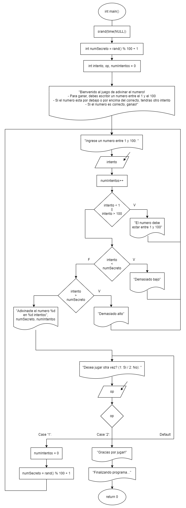

# Práctica 3. Juego de Adivinanza con Etiquetas y “goto”

Clase: Lenguaje C

### Instrucciones

---

Desarrollen el código en lenguaje C y elaboren el diagrama de flujo
correspondiente para los ejercicios. Será suficiente con un archivo .cpp que contenga todos los ejercicios organizados en un menú implementado mediante una estructura switch.

### Repositorio

---

[](https://github.com/Scalaptia/Lenguaje-C-HCF/tree/main/Practica3_JuegoAdivinanza)

### Diagrama de Flujo

---



### Problemas

---

Crear un juego de adivinanza de números utilizando etiquetas y la instrucción "goto" para
controlar el flujo del juego.

-   Inicialización del Juego:

*   Inicializa la semilla aleatoria utilizando srand(time(NULL)); para generar un número secreto aleatorio entre 1 y 100. Puedes usar rand() % 100 + 1 para esto.
    ```c
    int numSecreto = rand() % 100 + 1;
    ```
    -   Declara e inicializa una variable intentos a 0 para contar los intentos del usuario.
    ```c
    int numIntentos = 0;
    ```

-   Etiqueta de Inicio (inicio):

*   Muestra un mensaje de bienvenida y explica las reglas del juego.
    ```c
    printf("Bienvenido al juego de adivinar el numero!\n\n");
    printf("- Para ganar, debes escribir un numero entre el 1 y el 100\n");
    printf("- Si el numero esta por debajo o por encima del correcto, tendras otro intento\n");
    printf("- Si el numero es correcto, ganas!\n\n");
    ```

-   Etiqueta de Adivinanza (adivinanza):

*   Pide al usuario que adivine el número secreto.
    ```c
    printf("Ingrese un numero entre 1 y 100: ");
    scanf("%d", &intento);
    ```
    -   Incrementa la variable intentos en cada intento.
    ```c
    numIntentos++;
    ```

-   Comparación y Respuesta:

*   Compara el número ingresado por el usuario con el número secreto.
    -   Si el número del usuario es menor que el número secreto, muestra un mensaje indicando que el número es mayor y vuelve a la etiqueta adivinanza para otro intento.

    -   Si el número del usuario es mayor que el número secreto, muestra un mensaje
        indicando que el número es menor y vuelve a la etiqueta adivinanza para otro
        intento.

    -   Si son iguales, muestra un mensaje de felicitación con el número de intentos y finaliza el juego.
    ```c
    if (intento < 1 || intento > 100)
    {
        printf("El numero debe estar entre 1 y 100.\n");
        goto adivinanza;
    }

    if (intento < numSecreto)
    {
        printf("Demasiado bajo\n");
        goto adivinanza;
    }
    else if (intento > numSecreto)
    {
        printf("Demasiado alto\n");
        goto adivinanza;
    }
    else
    {
        printf("\nAdivinaste el numero %d en %d intentos\n", numSecreto, numIntentos);
        system("PAUSE");
        system("CLS");
        goto reinicio;
    }
    ```

-   Etiqueta de Reinicio (reinicio):

*   Pregunta al usuario si desea jugar de nuevo (1: Sí / 2: No).
    ```c
    printf("Desea jugar otra vez? (1: Si / 2: No): ");
    scanf("%d", &op);
    ```
    -   Si elige "Sí," reinicia el número secreto y la variable intentos y vuelve a la etiqueta inicio para comenzar un nuevo juego.
    -   Si elige "No," muestra un mensaje de despedida y finaliza el programa.
    -   Si elige una opción no válida, muestra un mensaje de error y vuelve a la etiqueta reinicio para pedir una respuesta válida.
    ```c
    switch (op)
    {
    case 1:
        numIntentos = 0;
        numSecreto = rand() % 100 + 1;
        goto adivinanza;
        break;

    case 2:
        printf("Gracias por jugar!\n");
        printf("Finalizando programa...");
        return 0;

    default:
        goto reinicio;
        break;
    }
    ```
