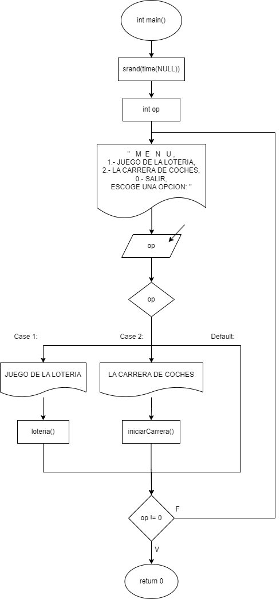
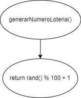
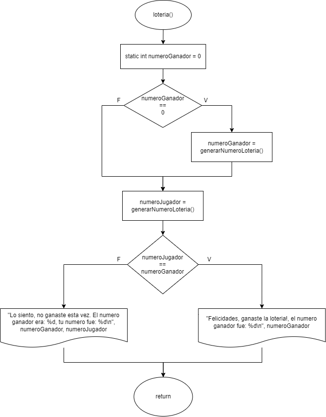
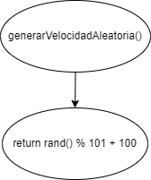
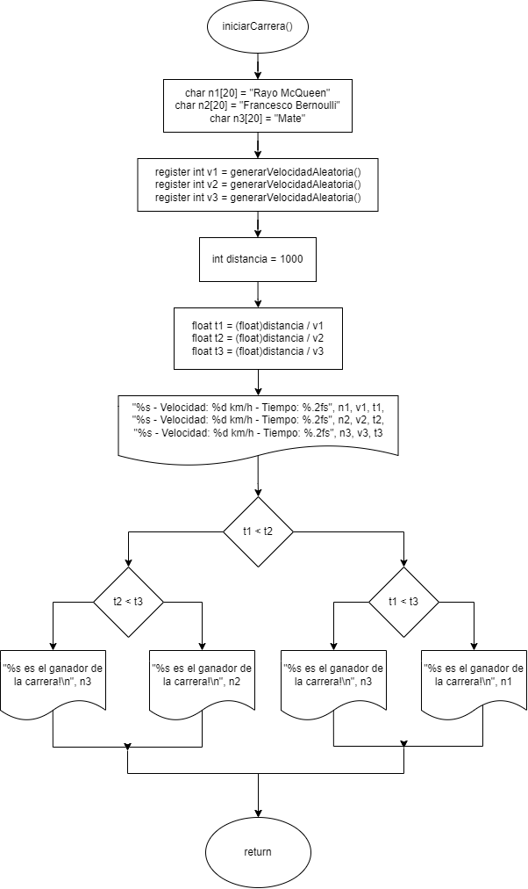

# Práctica 5. Clases de almacenamiento

Clase: Lenguaje C

### Instrucciones

---

Desarrollen el código en lenguaje C y elaboren el diagrama de flujo correspondiente para los ejercicios. Será suficiente con un archivo `.cpp` que contenga todos los ejercicios organizados en un menú implementado mediante una estructura switch.

### Repositorio

---

[](https://github.com/Scalaptia/Lenguaje-C-HCF/tree/main/Practicas/Practica5_ClasesDeAlmacenamiento)

### Inicio

---

**Diagrama de flujo:**



**Código:**

Inicializamos la semilla aleatoria y definimos la variable `op` que utilizaremos para decidir a que función queremos entrar.

```c
srand(time(NULL));
int op;
```

Creamos un ciclo do while, dentro del ciclo mostramos el menú al usuario y limpiamos la pantalla cuando se lee su selección.

```c
do
{
    system("CLS");
    printf("   M  E   N   U \n");
    printf("1.- JUEGO DE LA LOTERIA \n");
    printf("2.- LA CARRERA DE COCHES \n");
    printf("0.- SALIR  \n");
    printf("ESCOGE UNA OPCION: ");
    scanf("%d", &op);
    system("CLS");

		...

} while (op != 0);
```

Creamos un switch dentro del ciclo donde dependiendo de la opción ingresada se ejecuta su respectiva función.

```c
switch (op)
{
case 1:
    printf("   JUEGO DE LA LOTERIA \n");
    loteria();

    printf("\n");
    system("PAUSE");
    break;

case 2:
    printf("   LA CARRERA DE COCHES \n");
    iniciarCarrera();

    printf("\n");
    system("PAUSE");
    break;
}
```

### Problemas

---

**1- El juego de la lotería:** Simular un juego de lotería utilizando variables estáticas y automáticas en C.

**Diagrama de flujo:**





**Código:**

Crea una función llamada `generarNumeroLoteria` que genere un número aleatorio entre 1 y 100.

```c
int generarNumeroLoteria()
{
    return rand() % 100 + 1;
}
```

Utiliza una variable estática llamada `numeroGanador` para almacenar el número ganador. Esta variable debe ser inicializada solo una vez al comienzo del programa, si el numero no ha sido seleccionado le asignaremos un valor que se mantendrá constante en cada ejecución del programa por ser estático.

```c
static int numeroGanador = 0;

if (numeroGanador == 0)
{
    numeroGanador = generarNumeroLoteria();
}
```

En el `main()`, llama a `generarNumeroLoteria` para obtener el número de lotería de un jugador.

```c
int numeroJugador = generarNumeroLoteria();
```

Compara el número del jugador con el `numeroGanador`. Si coinciden, imprime "¡Felicidades, ganaste la lotería!". De lo contrario, muestra "Lo siento, no ganaste esta vez."

```c
if (numeroJugador == numeroGanador)
{
    printf("Felicidades, ganaste la loteria!, el numero ganador fue: %d\n", numeroGanador);
}
else
{
    printf("Lo siento, no ganaste esta vez. El numero ganador era: %d, tu numero fue: %d\n", numeroGanador, numeroJugador);
}
```

---

**2- La Carrera de Coches:** Variables de registro `register` en C para simular una carrera de coches.

**Diagrama de flujo:**





**Código:**

Declara tres variables de registro para representar a tres coches diferentes.

```c
register int v1 = generarVelocidadAleatoria();
register int v2 = generarVelocidadAleatoria();
register int v3 = generarVelocidadAleatoria();
```

Asigna nombres ficticios a cada coche, como "Coche1", "Coche2" y "Coche3".

```c
char n1[20] = "Rayo McQueen";
char n2[20] = "Francesco Bernoulli";
char n3[20] = "Mate";
```

Utiliza las variables de registro para almacenar las velocidades de cada coche. Genera velocidades aleatorias entre 100 y 200 km/h para cada coche.

```c
int generarVelocidadAleatoria()
{
    return rand() % 101 + 100;
}
```

Simula la carrera calculando el tiempo que le toma a cada coche recorrer una distancia ficticia (por ejemplo, 1000 metros) a su velocidad respectiva.

```c
int distancia = 1000;

float t1 = (float)distancia / v1;
float t2 = (float)distancia / v2;
float t3 = (float)distancia / v3;
```

Muestra los resultados de la carrera, incluyendo los nombres de los coches, sus velocidades y el tiempo que tardaron en cruzar la línea de meta.

```c
printf("\n%s - Velocidad: %d km/h - Tiempo: %.2fs\n", n1, v1, t1);
printf("%s - Velocidad: %d km/h - Tiempo: %.2fs\n", n2, v2, t2);
printf("%s - Velocidad: %d km/h - Tiempo: %.2fs\n\n", n3, v3, t3);
```

Identifica al coche ganador (el que cruza primero la línea de meta) y muestra su nombre como el ganador de la carrera.

```c
if (t1 < t2)
{
    if (t1 < t3)
    {
        printf("%s es el ganador de la carrera!\n", n1);
    }
    else
    {
        printf("%s es el ganador de la carrera!\n", n3);
    }
}
else
{
    if (t2 < t3)
    {
        printf("%s es el ganador de la carrera!\n", n2);
    }
    else
    {
        printf("%s es el ganador de la carrera!\n", n3);
    }
}
```
