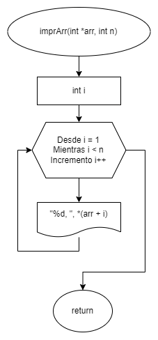
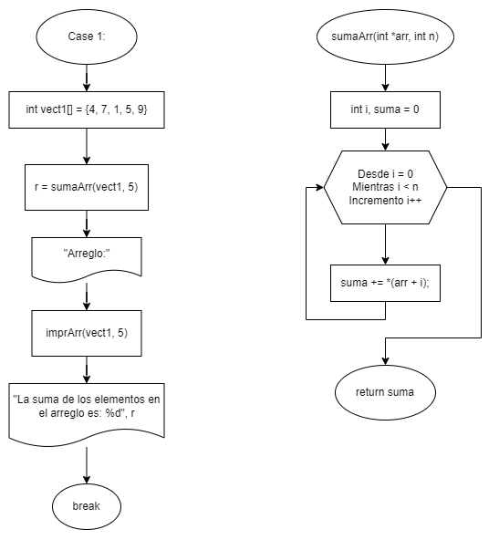
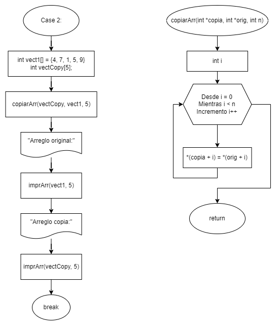
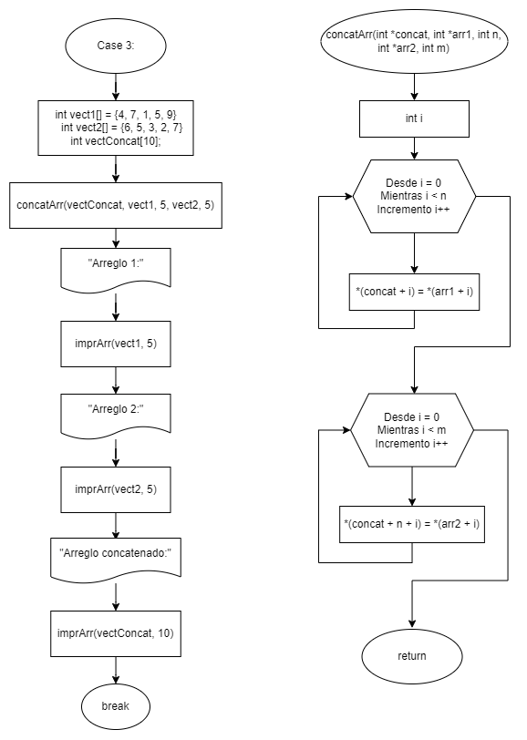
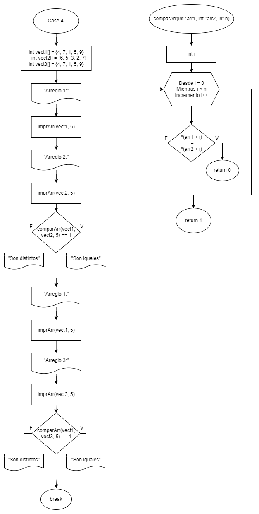
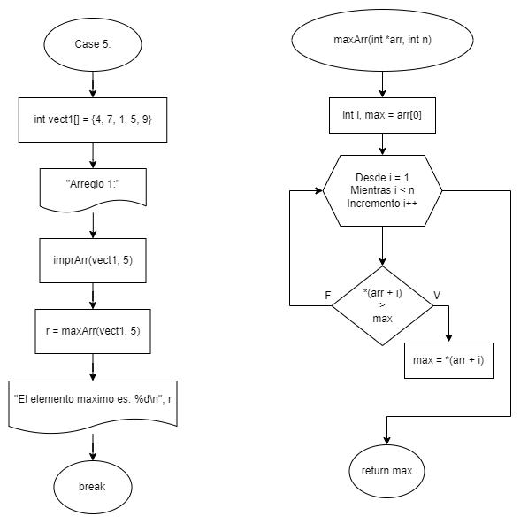

# Práctica 6. Apuntadores y Argumentos de Funciones

Clase: Lenguaje C

### Instrucciones

---

Desarrollen el código en lenguaje C y elaboren el diagrama de flujo correspondiente para los ejercicios. Será suficiente con un archivo `.cpp` que contenga todos los ejercicios organizados en un menú.

### Manipulación de cadenas usando apuntadores y funciones

---

El objetivo de esta práctica es crear un programa en C que realice operaciones básicas en arreglos utilizando apuntadores y funciones. Deberás crear un menú interactivo que permita al usuario elegir entre varias operaciones en un arreglo. Las operaciones incluirán la suma de elementos de un arreglo, la copia de arreglos, la concatenación de arreglos y la comparación de arreglos.



### Problemas

---

**1- Suma de elementos en un arreglo:** Crea una función que calcule la suma de los elementos en un arreglo utilizando apuntadores y aritmética de direcciones. La función debe tomar un apuntador al arreglo y devolver la suma.

**Diagrama de flujo:**



**Código:**

```c
case 1:
		r = sumaArr(vect1, 5);

		printf("Arreglo:\n");
		imprArr(vect1, 5);
		printf("\n\nLa suma de los elementos en el arreglo es: %d\n", r);
		break;
```

```c
int sumaArr(int *arr, int n)
{
		int i, suma = 0;

    for (i = 0; i < n; i++)
    {
        suma += *(arr + i);
    }

    return suma;
}
```

---

**2- Copia de arreglos:** Crea una función que copie un arreglo de origen en un arreglo de destino. Utiliza apuntadores para realizar esta operación. La función debe tomar dos apuntadores como argumentos, uno para el arreglo de origen y otro para el arreglo de destino.

**Diagrama de flujo:**



**Código:**

```c
case 2:
		copiarArr(vectCopy, vect1, 5);

		printf("Arreglo original:\n");
		imprArr(vect1, 5);
		printf("\n\nArreglo copia:\n");
		imprArr(vectCopy, 5);
		break;
```

```c
void copiarArr(int *copia, int *orig, int n)
{
    int i;

    for (i = 0; i < n; i++)
    {
        *(copia + i) = *(orig + i);
    }
}
```

---

**3- Concatenación de arreglos:** Crea una función que tome dos arreglos de entrada y los concatene en un tercer arreglo. Utiliza apuntadores y aritmética de direcciones para realizar la concatenación. La función debe tomar tres apuntadores como argumentos: dos para los arreglos de entrada y uno para el arreglo de destino.

**Diagrama de flujo:**



**Código:**

```c
case 3:
		concatArr(vectConcat, vect1, 5, vect2, 5);

		printf("Arreglo 1:\n");
		imprArr(vect1, 5);
		printf("\n\nArreglo 2:\n");
		imprArr(vect2, 5);
		printf("\n\nArreglo Concatenado:\n");
		imprArr(vectConcat, 10);
		break;
```

```c
void concatArr(int *concat, int *arr1, int n, int *arr2, int m)
{
    int i;

    for (i = 0; i < n; i++)
    {
        *(concat + i) = *(arr1 + i);
    }

    for (i = 0; i < m; i++)
    {
        *(concat + n + i) = *(arr2 + i);
    }
}
```

---

**4- Comparación de arreglos:** Crea una función que compare dos arreglos y determine si son iguales. Utiliza apuntadores y aritmética de direcciones para realizar la comparación. La función debe tomar dos apuntadores como argumentos y devolver un valor que indique si los arreglos son iguales.

**Diagrama de flujo:**



**Código:**

```c
case 4:
		printf("Arreglo 1:\n");
		imprArr(vect1, 5);
		printf("\n\nArreglo 2:\n");
		imprArr(vect2, 5);

		if (comparArr(vect1, vect2, 5) == 1)
		{
		    printf("\nSon iguales\n");
		}
		else
		{
		    printf("\nSon distinitos\n");
		}

		printf("\n\nArreglo 1:\n");
		imprArr(vect1, 5);
		printf("\n\nArreglo 3:\n");
		imprArr(vect3, 5);

		if (comparArr(vect1, vect3, 5) == 1)
		{
		    printf("\nSon iguales\n");
		}
		else
		{
		    printf("\nSon distinitos\n");
		}
		break;
```

```c
int comparArr(int *arr1, int *arr2, int n)
{
    int i;

    for (i = 0; i < n; i++)
    {
        if (*(arr1 + i) != *(arr2 + i))
        {
            return 0; // No son iguales
        }
    }

    return 1; // Si son iguales
}
```

---

**5- Encontrar el elemento máximo:** Crea una función que encuentre y devuelva el elemento máximo en el arreglo.

**Diagrama de flujo:**



**Código:**

```c
case 5:
		printf("Arreglo 1:\n");
		imprArr(vect1, 5);

		r = maxArr(vect1, 5);
		printf("\n\nEl elemento maximo es: %d\n", r);
		break;
```

```c
int maxArr(int *arr, int n)
{
    int i;
    int max = arr[0];

    for (i = 1; i < n; i++)
    {
        if (*(arr + i) > max)
        {
            max = *(arr + i);
        }
    }

    return max;
}
```
