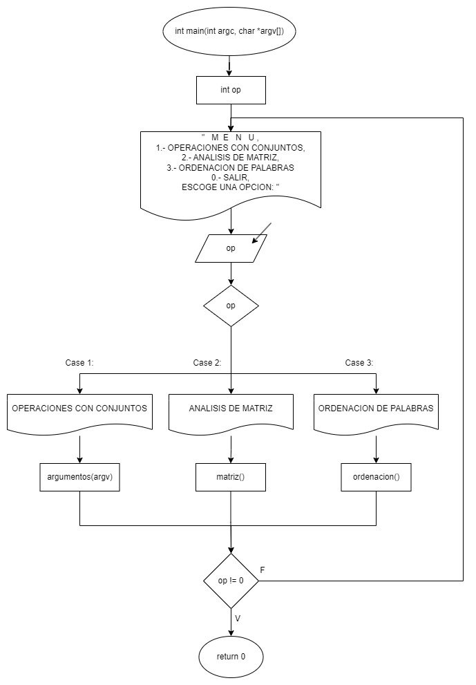
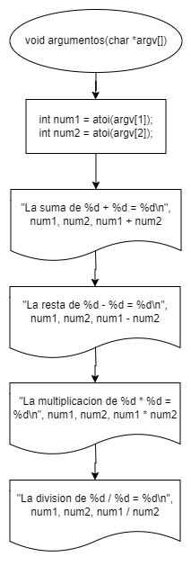
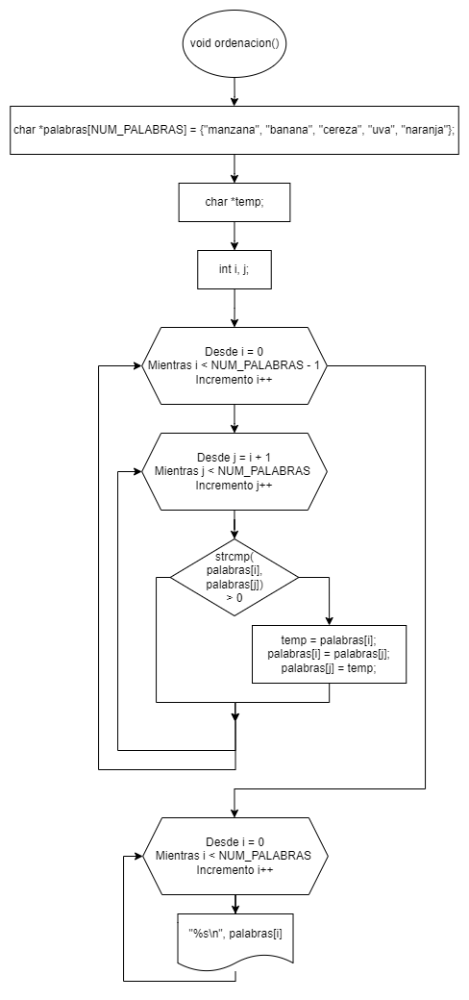
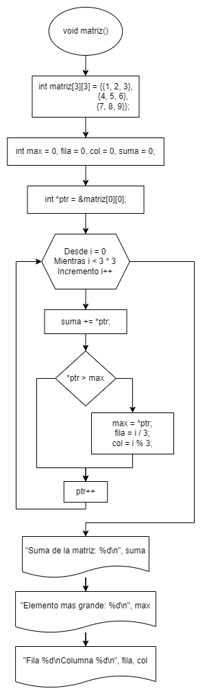

# Práctica 7. Punteros

Clase: Lenguaje C

### Instrucciones

---

Desarrollen el código en lenguaje C y elaboren el diagrama de flujo correspondiente para los ejercicios. Será suficiente con un archivo `.cpp` que contenga todos los ejercicios organizados en un menú.

### Inicio

---

**Diagrama de flujo:**



**Código:**

```c
int main(int argc, char *argv[])
{
    int op;

    do
    {
        printf("   M   E   N   U   \n");
        printf("1.- OPERACIONES CON ARGUMENTOS \n");
        printf("2.- ANALISIS DE MATRIZ \n");
        printf("3.- ORDENACION DE PALABRAS \n");
        printf("0. Salir\n");

        scanf("%d", &op);
        system("CLS");

        switch (op)
        {
        case 1:
            argumentos(argv);
            system("PAUSE");
            break;
        case 2:
            matriz();
            system("PAUSE");
            break;
        case 3:
            ordenacion();
            system("PAUSE");
            break;
        case 0:
            printf("Saliendo...\n");
            break;
        }

        system("CLS");
        printf("\n");
    } while (op != 0);

    return 0;
}
```

### Problemas

---

**a- Argumentos en la Línea de Comandos**

1. Crea un programa que tome dos números enteros como argumentos desde la línea de comandos.

2. Utiliza apuntadores para capturar estos argumentos y realizar las siguientes operaciones:
    - Suma los dos números y muestra el resultado.
    - Resta el segundo número del primero y muestra el resultado.
    - Multiplica los dos números y muestra el resultado.
    - Divide el primer número por el segundo y muestra el resultado.

**Diagrama de flujo:**



**Código:**

```c
void argumentos(char *argv[])
{
    int num1 = atoi(argv[1]);
    int num2 = atoi(argv[2]);

    printf("La suma de %d + %d = %d\n", num1, num2, num1 + num2);
    printf("La resta de %d - %d = %d\n", num1, num2, num1 - num2);
    printf("La multiplicacion de %d * %d = %d\n", num1, num2, num1 * num2);
    printf("La division de %d / %d = %d\n", num1, num2, num1 / num2);
}
```

---

**b- Ordenación de Palabras**

1. Crea un programa que incluya un arreglo de apuntadores a caracteres, donde cada apuntador apunta a una palabra (por ejemplo, "manzana", "banana", "cereza", "uva", "naranja").

2. Utiliza apuntadores y la aritmética de direcciones para ordenar las palabras en orden alfabético.

3. Imprime las palabras ordenadas en la consola.

**Diagrama de flujo:**



**Código:**

```c
void ordenacion()
{
    char *palabras[NUM_PALABRAS] = {"manzana", "banana", "cereza", "uva", "naranja"};
    char *temp;
    int i, j;

    // Ordenar
    for (i = 0; i < NUM_PALABRAS - 1; i++)
    {
        for (j = i + 1; j < NUM_PALABRAS; j++)
        {
            if (strcmp(palabras[i], palabras[j]) > 0)
            {
                temp = palabras[i];
                palabras[i] = palabras[j];
                palabras[j] = temp;
            }
        }
    }

    // Imprimir
    for (i = 0; i < NUM_PALABRAS; i++)
    {
        printf("%s\n", palabras[i]);
    }
}
```

---

**c- Matriz Multidimensional**

1. Crea una matriz bidimensional de enteros, por ejemplo, 3x3, con algunos valores.

2. Utiliza apuntadores y la aritmética de direcciones para recorrer la matriz y realizar las siguientes operaciones:
    - Calcula la suma de todos los elementos de la matriz.
    - Encuentra el elemento más grande en la matriz y muestra su valor y
      posición.

**Diagrama de flujo:**



**Código:**

```c
void matriz()
{
    int matriz[3][3] = {{1, 2, 3},
                        {4, 5, 6},
                        {7, 8, 9}};

    int max = 0, fila = 0, col = 0, suma = 0;

    int *ptr = &matriz[0][0];

    for (int i = 0; i < 3 * 3; i++)
    {
        suma += *ptr;
        if (*ptr > max)
        {
            max = *ptr;
            fila = i / 3;
            col = i % 3;
        }
        ptr++;
    }

    printf("\nSuma de la matriz: %d\n", suma);
    printf("Elemento mas grande: %d\n", max);
    printf("Fila %d\nColumna %d\n", fila, col);
}
```
