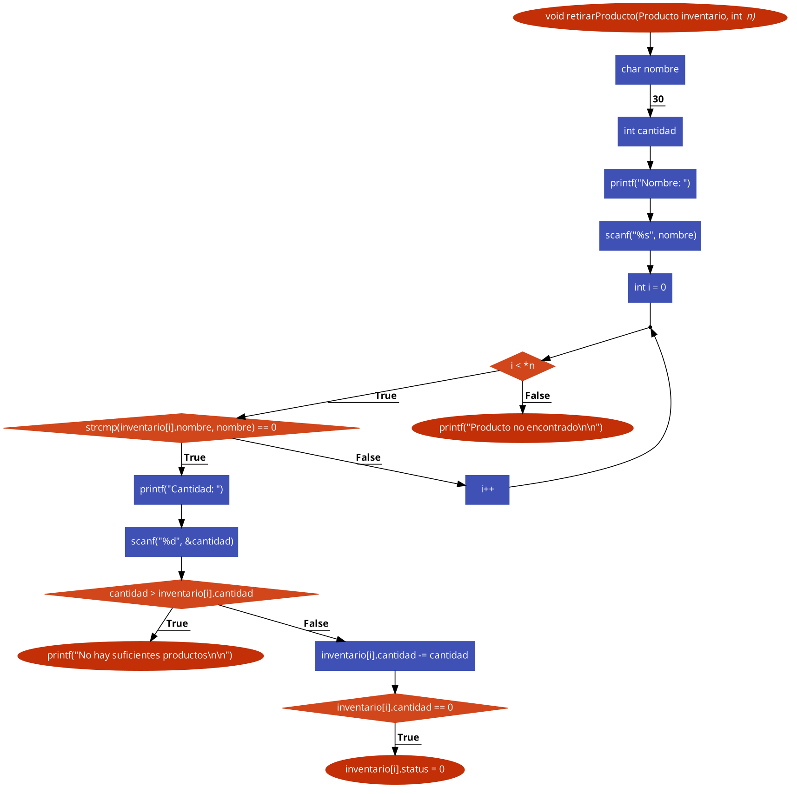
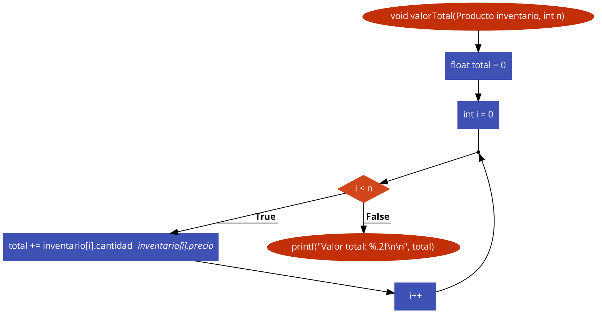

# Práctica 8. Estructuras

Clase: Lenguaje C

### Instrucciones

---

Desarrollen el código en lenguaje C y elaboren el diagrama de flujo correspondiente para los ejercicios. Será suficiente con un archivo `.cpp` que contenga todos los ejercicios organizados en un menú.

### Inicio

---

**Código:**

```c
int main()
{
    Producto inventario[MAX];
    int op, n = 0, nProductos = 0;

    do
    {
        system("CLS");
        printf("   M   E   N   U   \n");
        printf("1.- Agregar producto\n");
        printf("2.- Retirar producto\n");
        printf("3.- Mostrar inventario\n");
        printf("4.- Valor total\n");
        printf("5.- Ordenar\n");
        printf("6.- Salir\n");

        printf("\nOpcion: ");
        scanf("%d", &op);

        system("CLS");
        switch (op)
        {
        case 1:
            if (nProductos >= MAX)
            {
                printf("Inventario lleno\n\n");
                break;
            }

            printf("Agregar producto\n\n");
            agregarProducto(inventario, &n, nProductos);
            nProductos = calcProductos(inventario, n);
            break;

        case 2:
            if (nProductos < 1)
            {
                printf("Inventario vacio\n\n");
                break;
            }

            printf("Retirar producto\n\n");
            retirarProducto(inventario, &n);
            nProductos = calcProductos(inventario, n);
            break;

        case 3:
            printf("Mostrar inventario\n");
            mostrarInventario(inventario, n);
            break;

        case 4:
            printf("Valor total del inventario\n");
            valorTotal(inventario, n);
            break;

        case 5:
            printf("Ordenar\n\n");
            ordenar(inventario, n);
            break;

        case 6:
            return 0;

        default:
            printf("Opcion no valida\n");
            break;
        }
        system("PAUSE");
    } while (1);
}
```

### Problemas

---

a**- Crear una estructura:** Inicializa un inventario vacío con una capacidad máxima utilizando una estructura llamada “Producto” para representar los elementos del inventario. La estructura “Producto” debe incluir campos como nombre, cantidad y precio.

**Código:**

```c
typedef struct Producto
{
    int status;
    char nombre[30];
    int cantidad;
    float precio;
} Producto;
```

---

b**- Presenta al usuario un menú que le permita realizar las siguientes operaciones:**
✓ **Agregar elementos al inventario:** Permite al usuario ingresar el nombre, cantidad y precio del producto y agrega un nuevo elemento al inventario. Asegúrate de manejar situaciones en las que el inventario esté lleno.

**Diagrama de flujo:**


**Código:**

```c
void agregarProducto(Producto inventario[], int *n, int nProductos)
{
    printf("Nombre: ");
    scanf("%s", inventario[*n].nombre);

    do
    {
        printf("Cantidad (%d restantes): ", MAX - nProductos);
        scanf("%d", &inventario[*n].cantidad);
    } while (inventario[*n].cantidad > MAX - nProductos || inventario[*n].cantidad < 0);

    do
    {
        printf("Precio (Maximo $1000.00): ");
        scanf("%f", &inventario[*n].precio);
    } while (inventario[*n].precio < 0 || inventario[*n].precio > 1000.0f);

    inventario[*n].status = 1;
    (*n)++;
}
```

✓ **Retirar elementos del inventario:** Permite al usuario ingresar el nombre del producto que desea retirar y elimina ese elemento del inventario. Asegúrate de manejar casos en los que el elemento no esté en el inventario.

**Diagrama de flujo:**



**Código:**

```c
void retirarProducto(Producto inventario[], int *n)
{
    char nombre[30];
    int cantidad;

    printf("Nombre: ");
    scanf("%s", nombre);

    for (int i = 0; i < *n; i++)
    {
        if (strcmp(inventario[i].nombre, nombre) == 0)
        {
            printf("Cantidad: ");
            scanf("%d", &cantidad);

            if (cantidad > inventario[i].cantidad)
            {
                printf("No hay suficientes productos\n\n");
                return;
            }

            inventario[i].cantidad -= cantidad;

            if (inventario[i].cantidad == 0)
            {
                inventario[i].status = 0;
            }

            return;
        }
    }

    printf("Producto no encontrado\n\n");
}
```

✓ **Mostrar el inventario:** Muestra al usuario el contenido actual del inventario,
incluyendo el nombre, cantidad y precio de cada producto.

**Diagrama de flujo:**


**Código:**

```c
void mostrarInventario(Producto inventario[], int n)
{
    if (n < 1)
    {
        printf("\nInventario vacio\n\n");
        return;
    }

    printf("\nNOMBRE                 CANTIDAD   PRECIO I   PRECIO T\n\n");
    for (int i = 0; i < n; i++)
    {
        if (inventario[i].status == 1)
        {
            printf("%-20s", inventario[i].nombre);
            printf("   %-3d", inventario[i].cantidad);
            printf("        %-7.2f", inventario[i].precio);
            printf("    %-8.2f", inventario[i].cantidad * inventario[i].precio);
            printf("\n");
        }
    }
}
```

✓ **Calcular el valor total del inventario:** Agrega una opción al menú que calcule y muestre el valor total del inventario, que es la suma del precio de cada producto multiplicado por su cantidad en stock.

**Diagrama de flujo:**



**Código:**

```c
void valorTotal(Producto inventario[], int n)
{
    float total = 0;
    for (int i = 0; i < n; i++)
    {
        total += inventario[i].cantidad * inventario[i].precio;
    }

    printf("Valor total: %.2f\n\n", total);
}
```

✓ **Salir del programa:** Permite al usuario salir del programa cuando lo desee.

---

c- **Operaciones:** Implementa un bucle que permita al usuario realizar múltiples operaciones.

d- **Productos:** Utiliza incrementadores y decrementadores para ajustar la cantidad de productos en el inventario al agregar o retirar elementos.

e- **Validaciones:** Maneja situaciones en las que el inventario esté lleno o vacío. Asegúrate de validar las operaciones para evitar errores.

---

f- **Agrega una instrucción relacionada con la Práctica 2:**
✓ Ordenar elementos del inventario: Permite al usuario ordenar los productos en el inventario por nombre, cantidad o precio, según su elección.

**Diagrama de Flujo:**

.png>)

.png>)

.png>)

**Código:**

```c
void ordenar(Producto inventario[], int n)
{
    int op;
    Producto aux;

    do
    {
        system("CLS");
        printf("1.- Precio\n");
        printf("2.- Cantidad\n");
        printf("3.- Nombre\n");
        printf("4.- Salir\n");

        printf("\nOpcion: ");
        scanf("%d", &op);
        switch (op)
        {
        case 1:
            for (int i = 0; i < n - 1; i++)
            {
                for (int j = i; j < n; j++)
                {
                    if (inventario[i].precio > inventario[j].precio)
                    {
                        aux = inventario[i];
                        inventario[i] = inventario[j];
                        inventario[j] = aux;
                    }
                }
            }
            printf("\nOrdenado por precio\n\n");
            break;

        case 2:
            for (int i = 0; i < n - 1; i++)
            {
                for (int j = i; j < n; j++)
                {
                    if (inventario[i].cantidad > inventario[j].cantidad)
                    {
                        aux = inventario[i];
                        inventario[i] = inventario[j];
                        inventario[j] = aux;
                    }
                }
            }
            printf("\nOrdenado por cantidad\n\n");
            break;

        case 3:
            for (int i = 0; i < n - 1; i++)
            {
                for (int j = i; j < n; j++)
                {
                    if (strcmp(inventario[i].nombre, inventario[j].nombre) > 0)
                    {
                        aux = inventario[i];
                        inventario[i] = inventario[j];
                        inventario[j] = aux;
                    }
                }
            }
            printf("\nOrdenado por nombre\n\n");
            break;

        case 4:
            return;

        default:
            printf("Opcion no valida\n\n");
        }
    } while (op < 1 || op > 4);
}
```
