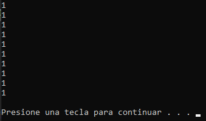
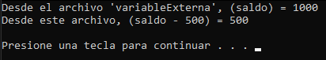
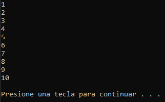
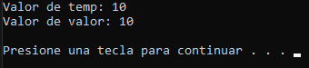
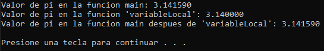

# Taller 5. Clases de almacenamiento

Clase: Lenguaje C

### Instrucciones

---

Durante este taller, vamos a resolver ejercicios relacionados con la unidad 3. Para cada ejercicio, declaren las variables, constantes y funciones necesarias para llevar a cabo la tarea requerida. Realicen el código a mano de los siguientes ejercicios\*.

### Problemas

---

1. **Declara una variable automática llamada contador en una función. Incrementa su valor en un bucle y muestra su valor en cada iteración. \* Invocar 10 veces**

**Código:**

```c
void contadorAuto()
{
    auto int contador = 0;

    contador++;

    printf("%d\n", contador);
}

int main()
{
		for (i = 0; i < 10; i++)
		{
		    contadorAuto();
		}
}
```

**Salida:**



**¿Qué sucede con la variable al salir de la función?**

Su vida útil está limitada al ámbito en el que se declara. Esto significa que la variable se crea cuando la función se llama y se destruye cuando la función sale.

---

2. **Declara una variable externa llamada saldo en un archivo fuente y accede a ella desde otro archivo fuente. Modifica su valor en ambos archivos y muestra el valor final.**

**Código:**

```c
// variableExterna.c

#include <stdio.h>

int saldo = 1500;
saldo = 1000;
```

```c
// Taller5_ClasesDeAlmacenamiento_HaroCalvo_Fernando.c

int main()
{
		extern int saldo;
    printf("Desde el archivo 'variableExterna', (saldo) = %d\n", saldo);

    saldo -= 500;
    printf("Desde este archivo, (saldo - 500) = %d\n", saldo);
}
```

******\*\*******Salida:******\*\*******



**¿Cómo afecta la visibilidad y el tiempo de vida de la variable externa?**

La variable externa tiene una visibilidad global y existe durante toda la ejecución del programa.

---

3. **Declara una variable estática llamada contador en una función y muestra su valor en cada llamada a la función. \* Invocar 10 veces**

**Código:**

```c
void contadorEstatico()
{
    static int contador = 0;

    contador++;

    printf("%d\n", contador);
}

int main()
{
		for (i = 0; i < 10; i++)
    {
        contadorEstatico();
    }
}
```

**Salida:**



**¿Qué sucede con la variable al salir de la función?**

Persiste el valor que tenía, es decir no se destruye ni se libera automáticamente.

**¿Cómo difiere de una variable automática?**

La variable estática mantiene su valor entre llamadas a la función, mientras que una variable automática se crea y destruye cada vez que la función se llama, por lo que su valor se reinicia en cada llamada.

La variable estática solo es visible dentro de la función en la que se declara, lo que significa que no puede ser accedida desde fuera de esa función. En contraste, una variable automática tiene un ámbito limitado al bloque en el que se declara, pero no se limita solo a una función.

Las variables estáticas se almacenan en una región especial de la memoria llamada "almacenamiento estático" y conservan su valor entre llamadas. Las variables automáticas se almacenan en la pila y se crean y destruyen automáticamente.

---

4. **Declara una variable de registro llamada temp y otra automática llamada valor en una función. Compara el acceso y el tiempo de vida de estas variables.**

******\*\*******Código:******\*\*******

```c
register int temp;
auto int valor;

temp = 10;
valor = 10;

printf("Valor de temp: %d\n", temp);
printf("Valor de valor: %d\n", valor);
```

******\*\*******Salida:******\*\*******



**¿Por qué usarías una variable de registro en lugar de una variable automática?**

Podrías considerar el uso de una variable de registro en situaciones en las que necesites acceder a una variable con la máxima velocidad posible y donde el tiempo de vida limitado a la función sea suficiente para tus necesidades. Sin embargo, hay que tener en cuenta que los compiladores modernos tienen la libertad de ignorar la solicitud de registro y pueden almacenar la variable en memoria si lo consideran más eficiente.

---

5. **Declara una variable global llamada pi con un valor de 3.14159 y otra variable local con el mismo nombre en una función (Con diferente valor). Intenta acceder a ambas variables desde diferentes partes del programa.**

****\*\*****Código:****\*\*****

```c
void variableLocal()
{
    float pi = 3.14;

    printf("Valor de pi en la funcion 'variableLocal': %f\n", pi);
}

int main()
{
		printf("Valor de pi en la funcion main: %f\n", pi);
    variableLocal();
    printf("Valor de pi en la funcion main despues de 'variableLocal': %f\n", pi);
}
```

**Salida:**



**Explica el concepto de ámbito y visibilidad.**

El ámbito se refiere a la región o contexto en la que una variable es válida y puede ser utilizada, mientras que la visibilidad se refiere a la capacidad de acceder a una variable desde un lugar específico en el código.

Si intentáramos acceder a una variable local fuera de su ámbito, y no estuviera declarada otra variable con el mismo identificador en ningún otro lado, obtendríamos un error de compilación, gracias a que las variables locales solo son válidas y accesibles dentro del bloque de código en el que se declaran. Una vez que se sale de ese bloque, la variable local deja de existir y no se puede acceder a ella.
